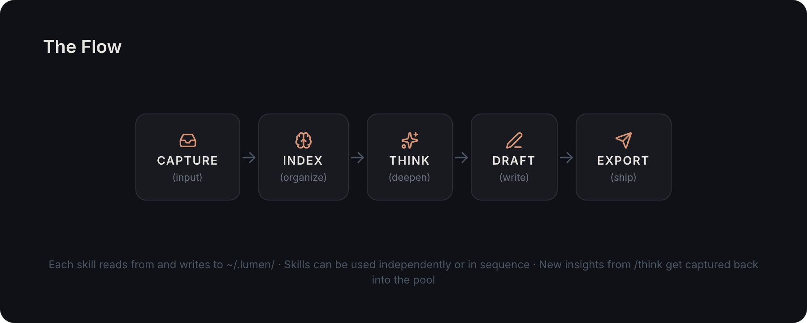
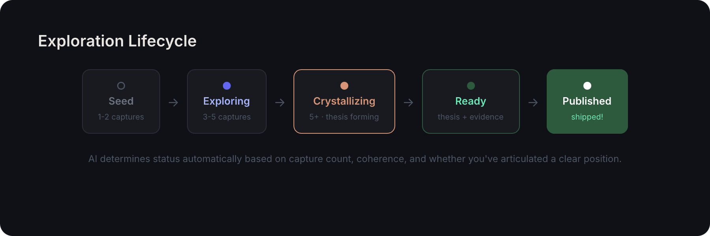
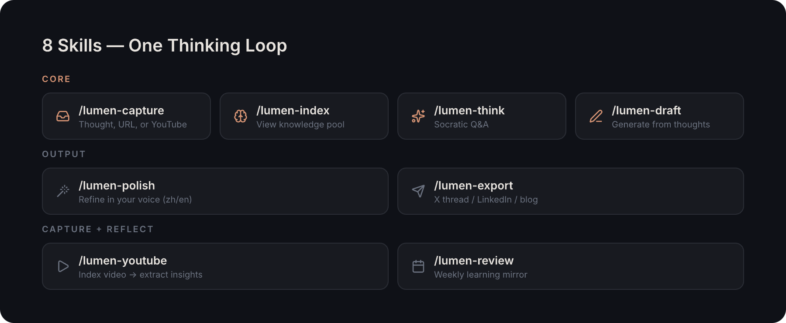

# ✦ Lumen

**Think clearly, write naturally.**

Claude Code skills that turn your CLI into a thinking + writing tool.
Like [gstack](https://github.com/garrytan/gstack) is for coding, **Lumen is for thinking.**



---

## The Problem

In the post-AI era, anyone can generate text. What's scarce is **structured personal knowledge + judgment**.

You consume YouTube videos, read articles, have conversations — but those fragments scatter across apps and vanish from memory. When it's time to write, you start from zero.

## The Solution

Lumen captures your knowledge fragments, indexes them automatically, and uses Socratic Q&A to help you **think clearly** — so writing emerges naturally from accumulated insight.

**You never organize.** You only judge what matters. AI does everything else.

---

## Install

### Prerequisites

- [Claude Code](https://claude.ai/code) with an active subscription (Pro or Max)
- macOS or Linux (Windows via WSL)
- Git

### Step 1: Clone

```bash
git clone https://github.com/howardpen9/lumen.git ~/.claude/skills/lumen
```

### Step 2: Setup

```bash
cd ~/.claude/skills/lumen && ./bin/setup
```

You should see:
```
  ✦ Lumen — Setting up skills

  ✓ Skills linked: ~/.claude/skills/lumen
  ✓ Data directory: ~/.lumen
  ✓ 8 skills installed

  Ready! Try these in Claude Code:
    /lumen-capture "your first thought"
    /lumen-index
    /lumen-think
```

### Step 3: Try It

Open Claude Code in any directory and run:

```
/lumen-capture "your first thought goes here"
```

That's it. You're capturing.

---

## Quick Start

### Your First Capture

Open Claude Code and try:

```
/lumen-capture "I think AI agent routing is fundamentally a product design problem, not an engineering one"
```

Lumen saves it to your knowledge pool, auto-tags it, and connects it to related thoughts.

### Index a YouTube Video

```
/lumen-youtube https://youtube.com/watch?v=dQw4w9WgXcQ
```

AI summarizes the video, extracts key insights, and asks you: **which insights matter to you?** Your judgment is the product.

### See Your Knowledge Pool

```
/lumen-index
```

```
✦ Your Knowledge Pool
  12 thoughts · 3 explorations · last capture: 2 hours ago

  ● AI Agent Routing                    Crystallizing
    8 thoughts · 2 refs · evolving since Mar 19
    → Ready to think deeper? Try /lumen-think agent-routing

  ○ Context Engineering                 Exploring
    3 thoughts · 1 paper · new since Mar 21

  ◌ Tauri vs Electron                   Seed
    2 thoughts · waiting for more input
```

### Think Deeper

```
/lumen-think agent-routing
```

AI presents your accumulated thoughts, identifies tensions, and asks Socratic questions — one at a time:

> "You keep saying 'context-aware routing.' What does that actually mean in practice?"

> "You believe static rules are wrong, but your Agent Hub still uses them. Why?"

> "If you had to explain your position in one sentence, what would it be?"

After 4-6 questions, AI suggests an outline based on your answers.

### Generate a Draft

```
/lumen-draft agent-routing
```

Turns your thoughts + Q&A insights into a coherent draft — in **your voice**, using **your words**. AI connects and expands, but never fabricates.

### Export Anywhere

```
/lumen-export agent-routing --format x-thread
/lumen-export agent-routing --format linkedin
/lumen-export agent-routing --format blog
```

---

## All Skills

| Skill | What it does | When to use |
|-------|-------------|-------------|
| `/lumen-capture` | Capture a thought, URL, or YouTube video | Anytime — see something worth remembering |
| `/lumen-youtube` | Index a YouTube video — AI summary + key insights | Found a video but no time to watch it all |
| `/lumen-index` | View your knowledge pool, auto-organized | Want to see what you've been thinking about |
| `/lumen-think` | Socratic Q&A to deepen an exploration | Have enough material, need to clarify your position |
| `/lumen-draft` | Generate a draft from accumulated thoughts | Ready to write — thoughts have crystallized |
| `/lumen-polish` | Refine in your voice (zh/en style profiles) | Draft done, need language quality |
| `/lumen-export` | Format for X thread / LinkedIn / blog | Ready to publish to a specific platform |
| `/lumen-review` | Weekly learning review — see yourself think | End of week — reflect on what you learned |

## Exploration Lifecycle

Your thoughts naturally progress through stages — AI determines status automatically:



## All 8 Skills at a Glance



Skills can be used independently or in sequence. Each skill reads from and writes to `~/.lumen/`.

---

## How Data is Stored

Everything lives in `~/.lumen/` — **local, portable, Git-friendly.** No cloud, no account, no vendor lock-in.

```
~/.lumen/
├── pool/              # Raw captures (markdown + YAML frontmatter)
├── explorations/      # AI-grouped topic clusters (JSON)
├── drafts/            # Generated drafts (markdown)
├── exports/           # Platform-formatted outputs
├── memory/            # Your writing style profiles (zh/en)
├── youtube/           # Video summary cache
└── reviews/           # Weekly review snapshots
```

See [DATA-FORMAT.md](DATA-FORMAT.md) for the full specification.

---

## Philosophy

### Judgment Materialization

Lumen doesn't write for you. It materializes your judgment.

Every time you say "this matters" or "I disagree with that" — that's a judgment call. Those calls are the atomic unit of knowledge work in 2026. AI can summarize, translate, and reformat — but only you can decide what's important.

Lumen captures those decisions, connects them over time, and helps you see what you actually think.

### Standing on Giants' Shoulders

Lumen leverages your existing Claude Code subscription. No extra API keys. No extra cost. We don't sell AI — we help you use the AI you already have.

Inspired by:
- [gstack](https://github.com/garrytan/gstack) — Skills that make Claude Code 10x productive for coding
- [Pencil.dev](https://pencil.dev) — Design intent → AI → design output
- [Conductor](https://conductor.build) — Parallel AI agents, native macOS

### Writing as Side Effect

> "Writing is dead, notes are alive" — more precisely: pure writing skill is commoditized, but structured personal knowledge + judgment is more valuable than ever.

Lumen's output isn't articles. It's **structured self-awareness of your own intellectual growth.** Articles, threads, and posts are just one serialization format.

---

## License

MIT
